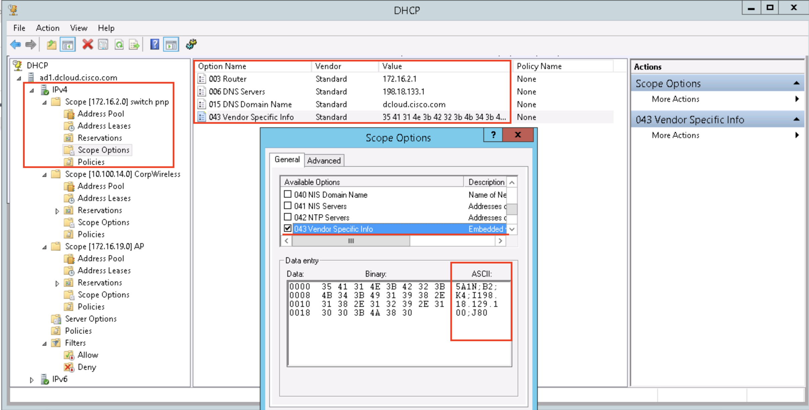
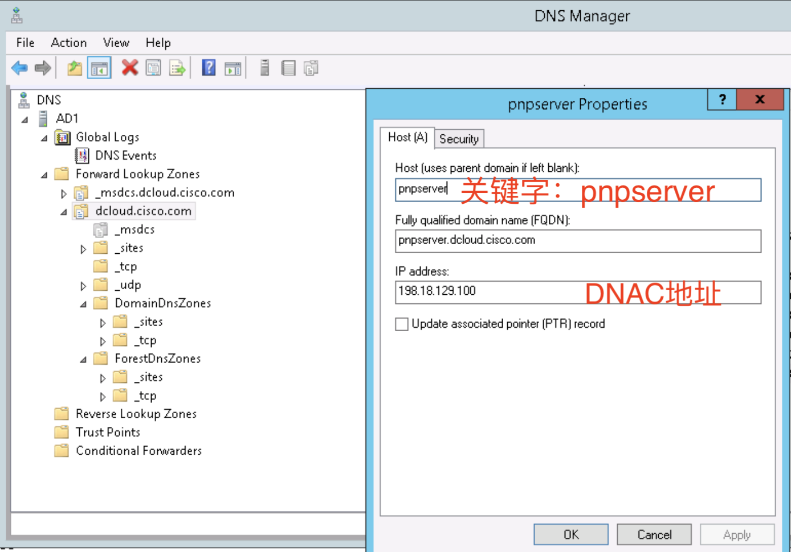

## DNAC PNP 实践 cheat sheet

请结合参考链接中的资料，特别是“Network Device Onboarding for Cisco DNA Center Deployment Guide”，开始动手实践，如何通过DNAC实现交换机设备的零配置上线。

- [DNAC PNP 实践 cheat sheet](#dnac-pnp-实践-cheat-sheet)
  - [PnP 设备上线：零配置上线介绍](#pnp-设备上线零配置上线介绍)
  - [PnP 设备上线：提前规划、准备工作](#pnp-设备上线提前规划准备工作)
  - [PnP 设备上线：网络环境准备-核心交换机的配置工作](#pnp-设备上线网络环境准备-核心交换机的配置工作)
  - [PnP 设备上线：DNAC 环境准备-提前完成SWIM 软件镜像管理设置](#pnp-设备上线dnac-环境准备-提前完成swim-软件镜像管理设置)
  - [PnP 设备上线：DNAC 环境准备- PnP template和Network Profile](#pnp-设备上线dnac-环境准备--pnp-template和network-profile)
  - [PnP 设备上线：待上线Agent设备恢复出厂](#pnp-设备上线待上线agent设备恢复出厂)
  - [PnP 设备上线：上线过程观察](#pnp-设备上线上线过程观察)
  - [PnP 设备上线：通过DNS上线（可选方式）](#pnp-设备上线通过dns上线可选方式)
  - [PnP 设备上线：Day-N template（可选）](#pnp-设备上线day-n-template可选)
  - [PnP 设备上线：参考链接](#pnp-设备上线参考链接)
  - [PnP 其他](#pnp-其他)

### PnP 设备上线：零配置上线介绍

本手册主要适用于：通过 Cisco DNAC 产品解决思科交换机设备**零配置**上线问题。

- 思科DNAC架构中可以支持多种设备的零配置上线流程，其中较为常用的是如下2种：
  - DHCP option 43方式，本手册中将主要介绍该实践流程；
  - DNS *pnpserver* host A方式，本手册也简单介绍如何使用DNS的方法；
- 需要新上线一批思科交换机设备（也支持其他种类的思科产品，但是所使用到的template有可能是不需要的，比如：sensor、AP产品等）；
- 假设这些交换机拟部署在传统的网络架构中：
  - 运行传统的 spanning tree 协议；
  - 网络一般采用传统的 L2 运行模式，核心（或者边缘）交换机上配置 SVI 接口；
  - 网络架构一般为三层（接入层、汇聚层、核心层）、或者二层（接入层、核心层）；
- 待上线交换机设备为接入层交换机，通过 port-channel 上联至核心交换机；
- 在双核心的网络架构中，建议先启用一台核心交换机设备进行 PnP 上线流程，待所有接入层设备上线之后（上线成功标记：交换机通过 DHCP 获取地址，在 DNAC 的 PnP 界面中看到这些交换机，并通过 claim 完成PNP整个流程），使用 day-N template 工具进行后续的配置工作；
- 通过本手册提供的步骤操作的话，接入层交换机设备将只有一根链路加入至 Port-channel 1 中，多根链路情况下，需要使用 day-N template 中增加其他的多链路至该 Port-channel 中；
- 推荐提前在 DNAC 中配置、并使用 SWIM（软件镜像管理），这样可以实现设备上线同时，完成设备的软件升级工作；
- 也可以提供后续Cisco DNA Center SDA架构所使用的*LAN automation、SDA FabricPEN* 节点上线参考；
- 也可以作为思科无线AP产品、sensor产品上线参考：无线AP上线也可以通过PNP上线至DNAC而不是WLC，之后通过provision操作、进而帮助AP、WLC的互联互通；

### PnP 设备上线：提前规划、准备工作

为了顺利完成设备的 PnP 上线流程，请提前规划、准备下述vlan、网段和待上线设备：

- VLAN A、IP 网段：主要用在PnP **启动 VLAN**，本手册中将使用 _vlan 2_作为例子，该 vlan 将用作设备上线 pnp 过程中通过 DHCP 获取地址所使用，是**临时** VLAN、和**临时** IP 网段，可多次重复被使用，满足*不同时段*的设备上线需求；
- VLAN B、IP 网段：**交换机设备的管理 VLAN**，该 VLAN 将用作交换机的管理 VLAN，请**规划、记录**好对应的该管理 IP 地址的使用情况，本手册中使用 _vlan 3_ 做为例子；
- 待上线设备的物理安装、加电，并能够正常启动至配置对话框，**请注意不要进行设备的操作**，后续的设备操作将由PNP流程自动化完成；
  
    ```
    --- System Configuration Dialog ---

    Would you like to enter the initial configuration dialog? [yes/no]:
    ```

> **如果网络中已经部署DHCP**：设备启动过程中，可能已经通过网络中部署的DHCP 服务器获取到IP地址和对应的其他信息。
> - 请登陆至交换机设备检查IP、路由、以及所使用的端口信息；
> - 在DHCP服务器中检查IP地址使用情况，是否和待上线设备信息一致；
> - 在DNAC unclaimed PNP表格中检查对应的设备状态。
> - 强烈建议按初始化脚本实现设备的**出厂配置**；


### PnP 设备上线：网络环境准备-核心交换机的配置工作

- 核心交换机配置准备，需要完成如下这些任务:

  - 核心设备至 DNAC 服务器的多个网段的互通检查：包括该设备的管理 IP、以及 DHCP Pool 里面的待分配的临时 IP 网段、以及上线交换机设备管理网段；
  - DHCP Pool ，实现 DHCP Option 43：该临时网段将被使用在自动分配给待上线的接入层交换机设备，采用的上线VLAN为*临时 VLAN 2*；
  - 对应的预配置：与接入层交换机的互联端口实现 port-channel、trunk，并完成 PnP vlan 2 和交换机管理 vlan 3 配置；
  - 一般来说，核心交换机上已经配置 vlan 3（设备管理网段），其对应的 vlan3 配置可以忽略；

- 核心交换机配置参考：配置 DHCP Pool，请注意查看 DHCP option 43 设置方法，其中的*198.18.129.100* 为 DNAC 服务器 IP 地址，除了 DNAC IP 地址根据现网环境需要修改外，一般来说其他字段不需要更改。**172.16.2.1** 为PnP vlan 2 的 interface vlan IP 地址，配置在核心交换机上。

```
ip dhcp excluded-address 172.16.2.1
!
ip dhcp pool PnP_device_vlan2
 network 172.16.2.0 255.255.255.0
 default-router 172.16.2.1
 domain-name local.domain.com
 dns-server 198.18.133.1
 option 43 ascii "5A1N;B2;K4;I198.18.129.100;J80"
!
```

> **IOS DHCP Server配置**：
>   - 如果在核心交换机上使用DHCP SERVER功能中，采用DHCP option 43方式实现PNP服务器地址的通知，则domain-name、dns-server的配置是可选的。
>   - **注意 DHCP relay 功能**：如果采用外部DHCP服务器，一般来说该服务器位于共享服务区，则不需要在设备上配置DHCP pool。core 交换机设备的 SVI （vlan 2）端口下，需要配置 _dhcp relay_ 功能：ip helper-address 198.18.133.1（该地址198.18.133.1为DHCP SERVER地址）
> 关于如何配置DHCP服务器 - [ Chapter: Configuring DHCP ](https://www.cisco.com/c/en/us/td/docs/switches/lan/catalyst9500/software/release/16-5/configuration_guide/sec/b_165_sec_9500_cg/configuring_dhcp.html)




> **技术比较**：和使用在思科无线AP产品定位其无线控制器WLC的DHCP option 43方法（option 43 hex f104c6128164：F1代表思科无线，04为长度-字节数，之后为WLC IP地址），设置方法**很不同**：[ Wireless Controllers Option 43 Generator ](https://shimi.net/services/opt43/)

- 核心交换机配置参考：配置 PnP VLAN，下述的例子中为 vlan 2，并配置其 SVI 接口 IP 地址，VLAN 3 管理网段的配置供参考。

```
! 采用vlan 2作为PNP启动vlan。
! set vlan 2 as PnP startup VLAN
pnp startup-vlan 2
!
vlan 2
 name pnp-vlan-2
!
int vlan 2
 ip address 172.16.2.1 255.255.255.0

! VLAN 3为网管网段
vlan 3
 name switch-management-vlan-3
!
int vlan 3
 ip address 172.16.3.1 255.255.255.0
```

- 核心交换机配置参考：配置与接入层交换机的互联接口，该端口一般使用 port-channel 方法。具体的物理端口、**Port-channel ID** 请根据实际情况进行调整。

```
interface range gi1/0/1-2
  channel-group 1 mode active
interface port-channel 1
  switch mode trunk
!
...
!
interface range gi1/0/11-12
  channel-group N mode active
interface port-channel N
  switch mode trunk
```

- 核心交换机配置参考：配置该 DHCP Pool 网段、管理网段的可达性，下述例子中将通过 BGP 宣告该网段，实现 2 个网段至 DNAC 服务器的互通

```
router bgp 65003
 add ipv4
  network 172.16.2.0 mask 255.255.255.0
  network 172.16.3.0 mask 255.255.255.0
```
通过*ping dnac-ip-address source vlan 2/3*检查其互通性。


### PnP 设备上线：DNAC 环境准备-提前完成SWIM 软件镜像管理设置

新设备上线过程中，如果在 DNAC 中完成配置 Campus Software Image Management - 简称为 SWIM，则可以为该设备自动进行 IOS 软件的升级工作。
DNAC 中需要完成的 SWIM 主要任务包括：

- Golden Image import/ auto download 文件导入或者从 CCO 自动下载；
- Golden Image 设备（交换机）软件镜像文件 golden 标注；

> **SWIM 设置参考**：
>
> - 如果想知道如何使用 DNAC 中的 SWIM 功能，请参考： [ Campus Software Image Management Using Cisco DNA Center Deployment Guide ](https://www.cisco.com/c/dam/en/us/td/docs/solutions/CVD/Campus/dnac-swim-deployment-guide-2020mar.pdf)，
> - SWIM golden image 在 DNAC 中的设置，主要通过 _design_ -> _Image Repository_ 来完成

### PnP 设备上线：DNAC 环境准备- PnP template和Network Profile

根据参考链接中实施PnP的材料，在 DNAC 中完成 PnP 相关的配置工作，其任务主要包括：

- 在*Template Editor* -> _Onboarding Configuration_ 中**添加 template**；

  设备上线流程中的 template，一般来说推荐采用最小，最轻量化来实现：

  - 管理 IP、VLAN 设置，本例子是 vlan 3 的配置；
  - 配置通过管理网段的默认路由，实现至 DNAC 的可达性；
  - 修改 port-channel 端口的 vlan allow许可；
  - 修改与 DNAC 通讯所使用的端口为管理 vlan；
  - 删除临时 vlan 2 和 临时 SVI - interface vlan 2；

```
hostname $hostname

interface Port-channel1
  switchport trunk allowed vlan all

vlan 3
  name switch-management-vlan-3

int vlan 3
  ip address $ipaddress 255.255.255.0
  no shu

ip route 0.0.0.0 0.0.0.0 172.16.3.1

ip http client source-interface Vlan3

no vlan 2
no int vlan 2

```

> **Template Editor 模板工具使用说明**：
>
> - 紧跟 **\$** 符号之后，定义了模板中的参数名称：例子中*hostname*为 hostname 的参数，*ipaddress*为该设备的 vlan 3 的 IP 地址参数，2 个参数将在后续的 PnP claim 过程中被输入、赋值。
>   通过上述简单的模板，在设备 claim 中，只需要输入 hostname、管理 IP 地址即可实现设备的基础配置，并完成被 DNAC 纳管。
> - **通过该模板中，上线设备在 claim 中将改变其 IP 地址，由最初的 vlan2 的 IP 地址，更改为 vlan3 的管理 IP 地址**；
> - Template 设置完毕，需要保存、以及 commit，才能后续被使用。
> - hostname 设置：在DNAC 1.3.3版本之后，在PNP table中已经可以提前完成hostname的设置，不需要在template中进行设置。

- 在*Design* -> _Network Profiles_ 中**添加 基于 switch 的 profile**，并绑定至一个 site 或者多个 sites

  - 在 _OnBoarding Template(s)_ 中绑定的名称为上个步骤中的 template 名称；
  - 在 _Day-N Template(s)_ 中的绑定使用于 day-N，也就是日常运维过程中配置下发，不在新设备上线过程中使用；
  - 完成 Network Profile定义之后，需要将其分配至site；

- 检查在*Design* -> _Network Settings_ -> _Device Credentials_ 中，在对应的 site 里面配置了设备登陆使用的用户名、密码，以及 SNMP read/write 字串，该部分配置将在 claim 中被推送至设备。

- 如果已经完成了思科ISE和DNAC的集成工作，交换机的设备信息也将在claim过程中被推送至ISE。
  

### PnP 设备上线：待上线Agent设备恢复出厂

PnP agent 设备，就是即将上线的交换机设备，如果上电之后设备处于下述的*出厂模式*，则可以跳过本步骤。

```
         --- System Configuration Dialog ---

Would you like to enter the initial configuration dialog? [yes/no]:


Press RETURN to get started!

```

如果设备上电之后，发现设备存在**残留配置**，则需要按照下述步骤进行初始化设备操作，并删除证书文件：

```
config terminal
    no pnp profile pnp-zero-touch
    no crypto pki certificate pool      (回答yes)
    config-register 0x2102
end

delete /force vlan.dat
delete /force nvram:*.cer

write erase     (回车确定)
reload          (回答no)
```

> **PnP agent 设备初始化排障**：具体请参考[ Network Plug and Play Troubleshooting Guide ](https://www.cisco.com/c/en/us/td/docs/cloud-systems-management/network-automation-and-management/dna-center/tech_notes/pnp-troubleshooting.html)

### PnP 设备上线：上线过程观察

经过以上步骤，已经完成了 PnP 设备上线的准备工作，待 PnP agent 设备启动完毕，该设备自动进入 PnP，最简单的方法是，可以观察到其从 DHCP 服务器自动获取 IP 地址，并且可以在 DNAC PnP 界面上看到该设备处于*unclaimed*状态。

```
--- System Configuration Dialog ---

Would you like to enter the initial configuration dialog? [yes/no]:


Press RETURN to get started!


*Sep 16 06:57:12.579: %CRYPTO_ENGINE-5-KEY_ADDITION: A key named TP-self-signed-3188499853 has been generated or imported by crypto-engine
*Sep 16 06:57:12.580: %SSH-5-ENABLED: SSH 1.99 has been enabled
*Sep 16 06:57:12.624: %PKI-4-NOCONFIGAUTOSAVE: Configuration was modified.  Issue "write memory" to save new IOS PKI configuration
*Sep 16 06:57:12.625: %SYS-5-CONFIG_P: Configured programmatically by process PnP Agent Discovery from console as vty0
*Sep 16 06:57:12.737: %CRYPTO_ENGINE-5-KEY_ADDITION: A key named TP-self-signed-3188499853.server has been generated or imported by crypto-engine
*Sep 16 06:57:14.627: %SYS-5-CONFIG_P: Configured programmatically by process PnP Agent Discovery from console as vty0
*Sep 16 06:57:14.627: %PNP-6-PNP_SAVING_TECH_SUMMARY: Saving PnP tech summary (pnp-tech-discovery-summary)... Please wait. Do not interrupt.
*Sep 16 06:57:19.395: %SYS-5-CONFIG_P: Configured programmatically by process PnP Agent Discovery from console as vty0
*Sep 16 06:57:20.414: %SYS-5-CONFIG_P: Configured programmatically by process PnP Agent Discovery from console as vty0
*Sep 16 06:57:21.433: %SYS-5-CONFIG_P: Configured programmatically by process PnP Agent Discovery from console as vty0
*Sep 16 06:57:26.482: %SYS-5-CONFIG_P: Configured programmatically by process PnP Agent Discovery from console as vty0
*Sep 16 06:57:28.000: %SYS-6-CLOCKUPDATE: System clock has been updated from 06:57:26 UTC Wed Sep 16 2020 to 06:57:28 UTC Wed Sep 16 2020, configured from console by vty0.
Sep 16 06:57:28.000: %PKI-6-AUTHORITATIVE_CLOCK: The system clock has been set.
Sep 16 06:57:28.003: %SYS-5-CONFIG_P: Configured programmatically by process XEP_pnp-zero-touch from console as vty0
Sep 16 06:57:28.004: %SMART_LIC-5-SYSTEM_CLOCK_CHANGED: Smart Agent for Licensing System clock has been changed
Sep 16 06:57:28.626: %PNP-6-PNP_TECH_SUMMARY_SAVED_OK: PnP tech summary (pnp-tech-discovery-summary) saved successfully.
Sep 16 06:57:28.627: %PNP-6-PNP_DISCOVERY_DONE: PnP Discovery done successfully (PnP-DHCP-IPv4)
Sep 16 06:57:31.865: %PKI-6-TRUSTPOINT_CREATE: Trustpoint: pnplabel created succesfully
Sep 16 06:57:31.873: %PKI-4-NOCONFIGAUTOSAVE: Configuration was modified.  Issue "write memory" to save new IOS PKI configuration
Sep 16 06:57:32.945: %SYS-5-CONFIG_P: Configured programmatically by process PnP reconnect profile from console as vty0
Sep 16 06:57:33.027: %SYS-5-CONFIG_P: Configured programmatically by process XEP_pnp-zero-touch from console as vty0
Sep 16 06:57:34.390: %AN-6-AN_ABORTED_BY_CONSOLE_INPUT: Autonomic disabled due to User intervention on console. configure 'autonomic' to enable it.
%Error opening tftp://255.255.255.255/network-confg (Timed out)
Sep 16 06:57:50.351: AUTOINSTALL: Tftp script execution not successful for Vl2.
Sep 16 07:00:15.809: %PLATFORM_FEP-1-FRU_PS_ACCESS: Switch 1: power supply B is not responding
Switch>

```

> **PnP agent 信息观察**：PNP成功启动，可以观察到：%PNP-6-PNP_DISCOVERY_DONE: PnP Discovery done successfully
> **此刻开始**，可以通过命令行界面激活**EEM脚本**观察DNAC推送的配置信息，具体请参考下述步骤。


后续通过 DNAC 界面的 claim 交互操作中完成设备的上线，其中需要我们输入的信息为：hostname、和设备的管理IP。


### PnP 设备上线：通过DNS上线（可选方式）

如果采用DNS上线方式，则我们在DHCP server中不需要设置option 43，但是需要在DHCP response信息中，提供DNS相关信息（domain name、DNS地址），并在DNS服务器中设置好特定host入口。

不管上线设备是交换机，还是无线AP产品，我们可以采用同一个vlan 2来上线设备，DHCP不设置option 43。在DNS中设置不同产品的不同host记录即可。

- **pnpserver**.local.domain 指向DNAC服务器IP；
- local.domain按企业自身的具体设置；

> **技术比较**：使用在思科无线AP产品定位其无线控制器WLC的DNS方法，DNS中需要设置host：**CISCO-CAPWAP-CONTROLLER**




### PnP 设备上线：Day-N template（可选）

DAY-N 配置模板，主要针对网络日常运维中的标准化配置下发，大量端口开通、配置变更等需求。
如何使用DAY-N template工具实现后续的配置下发工作，需要完成步骤如下：

- 可以登陆设备激活EEM配置脚本，可以观察到DNAC推送的具体配置信息；
  
```
conf t
event manager applet catchall
event cli pattern ".*" sync no skip no
action 1 syslog msg "$_cli_msg"
```

- DAY-N template设置，并在template 正文中设置配置保存（由于DAY-N template 配置不自动保存，注意需要特别处理，也可以后续人工、自动化操作配置保存）：

```
interface $interface
 description uplink
 switchport mode trunk
 no device-tracking attach-policy IPDT_MAX_10
 channel-group 1 mode active
 exit

#MODE_ENABLE
write memory
#END_MODE_ENABLE
```
> 配置保存还可以直接使用命令：do write memory、do copy running start等，这样就不需要添加“#MODE_ENABLE”、“#END_MODE_ENABLE”。
> 上文中的配置，主要目的是：将上联端口加入至已有的port-channel端口中，来完成传统网络的搭建。

- 在DAY-N template中，可以定义source to binding变量，该类变量数据将来自于DNAC已经学习到的、已知的数据；
- 修改design-> network profile中的对应的设备NP，并增加DAY-N template；
- 使用provision流程工具完成DAY-N配置下发；

> **DAY-N 模板注意点**：使用DAY-N模板，需要注意该模板在DNAC配置下发过程中，这些配置在目标设备中是逐条执行的，所以需要考虑配置不影响到DNAC和设备的互相访问。
> 如果有访问中断可能，需要考虑其他实现方式，比如在设备中运行EEM脚本的配置方法。


### PnP 设备上线：参考链接

- [ UP-TO-SPEED-ON-CISCO PDF文件 ](https://www.cisco.com/c/dam/global/da_dk/training-events/seminaria-materials/pdf/up-to-speed-on-cisco--dna_center.pdf)，更新日期：2020.04
- [ Network Device Onboarding for Cisco DNA Center Deployment Guide PDF文件 ](https://www.cisco.com/c/dam/en/us/td/docs/solutions/CVD/Campus/dnac-network-device-onboarding-deployment-guide-2020jun.pdf)，更新日期：2020.06
- [ Design Zone for Campus- Design Guides ](https://www.cisco.com/c/en/us/solutions/enterprise/design-zone-campus/design-guide-listing.html)
- [ LAN Automation: Step-by-step deployment guide and Troubleshooting ](https://www.cisco.com/c/en/us/support/docs/cloud-systems-management/dna-center/215336-lan-automation-step-by-step-deployment.html)
- [ DHCP option 43 如何设置 ](https://community.cisco.com/t5/cisco-digital-network/pnp-with-day-0-template/td-p/4011894)
- [ 在DNAC中如何使用模板语言1 ](https://blogs.cisco.com/developer/velocity-templates-dnac-1)
- [ 在DNAC中如何使用模板语言2 ](https://blogs.cisco.com/developer/velocity-templates-dnac-2)
- [ 在github分享 DNAC-TEMPLATES ](https://github.com/kebaldwi/DNAC-TEMPLATES)
- [ DNAC手册：Create Templates to Automate Device Configuration Changes ](https://www.cisco.com/c/en/us/td/docs/cloud-systems-management/network-automation-and-management/dna-center/1-3/user_guide/b_cisco_dna_center_ug_1_3/b_cisco_dna_center_ug_1_3_chapter_0111.html)

### PnP 其他

本手册更新于：2020.11，有问题联系：<yijxiang@cisco.com>
